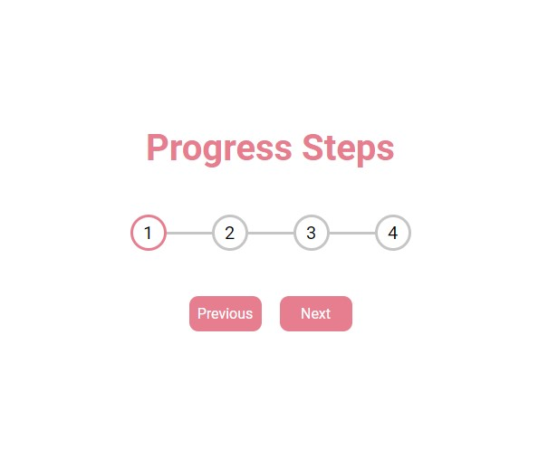

# 50 Projects In 50 Days - Progress Steps | Hidden Search Widget | Split Landing Page

This is a solution to the 3 projects of [50 Projects In 50 Days - HTML, CSS & JavaScript Course](https://www.udemy.com/course/50-projects-50-days/). These projects are done via looking at project intro videos of the example projects before the introduction of the instructor's solution.

## Table of contents

- [50 Projects In 50 Days - Progress Steps | Hidden Search Widget | Split Landing Page](#50-projects-in-50-days---progress-steps--hidden-search-widget--split-landing-page)
  - [Table of contents](#table-of-contents)
  - [Overview](#overview)
    - [The challenge](#the-challenge)
    - [Screenshot](#screenshot)
    - [Links](#links)
  - [My process](#my-process)
    - [Built with](#built-with)

## Overview

### The challenge

Users should be able to:

-   View the optimal layout for the app depending on their device's screen size
-   See hover states for all interactive elements on the page
-   Add fuctionality with Javascript

### Screenshot

 
 
 

<!-- 

 -->

### Links

-   Solution URL: [Live Website](https://gurhanalan.github.io/JS-SmallProjects-ProgressSteps/)

## My process

### Built with

-   Semantic HTML5 markup
-   CSS custom properties
-   Flexbox
-   CSS Grid
-   Desktop-first workflow
-   Javascript
